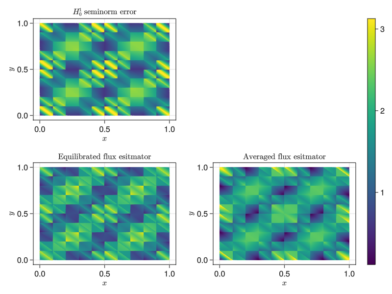
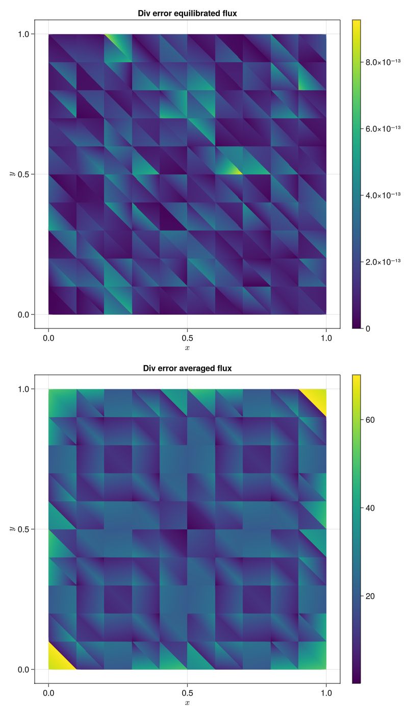

# EqFlux.jl

This package is based on the
[Gridap.jl](https://github.com/gridap/Gridap.jl/tree/master) to provide tools to calculate a
posteriori error estimates for numerical solutions of
partial differential equations (PDEs). For simplicity, we consider here the
Poisson equation
\begin{align}
- \Delta u &= f &&\text{in }\Omega\\
u &= g &&\text{on }\partial\Omega.
\end{align}
We suppose we have already computed a conforming approximation
$u_h \in V_h\subset H^1_0(\Omega)$ to the solution $u$ in Gridap.jl by solving
$$(\nabla u_h, \nabla v_h) = (f, v_h)\quad\forall v_h\in V_h,$$
for this see for example the
[first Gridap.jl tutorial](https://gridap.github.io/Tutorials/dev/pages/t001_poisson/#Tutorial-1:-Poisson-equation-1).
The `EqFlux.jl` library then provides the tools to compute an estimator
$\eta(u_h)$ such that the error measured in the $H^1_0$-seminorm
can be bounded as
$$\|\nabla(u - u_h)\| \le \eta(u_h),$$
which we refer to as reliability of the estimator. We also can prove the bound
$$\eta(u_h) \lesssim \|\nabla(u - u_h)\|$$
which we refer to as efficiency. The main ingredient in computing this estimator
is a reconstructed flux obtained by postprocessing that is an approximation
to the numerical flux, i.e., $\sigma_h\approx -\nabla u_h$. This
flux has the important property of being "conservative over faces" in the sense
that
$$\sigma_h \in \mathbf{H}(\mathrm{div},\Omega).$$
we provide two functions to obtain this object:
`build_equilibrated_flux` and `build_average_flux` which we denote by
$\sigma_{\mathrm{eq},h}$ and $\sigma_{\mathrm{ave},h}$ respectively.
. In addition, for the
equilibrated flux $\sigma_{\mathrm{eq},h}$ satisfies the so-called equilibrium
condition, i.e., for piecewise polynomial $f$, we have
$$\nabla\cdot\sigma_{\mathrm{eq},h} = f.$$
In either case,the estimator takes the form
$$\eta(u_h) = \| \sigma_{\cdot,h} + \nabla u_h\|.$$

# Demonstration
We set $\Omega = (0,1)^2$ to be the unit square in 2D. We use a uniform
simplicial mesh $\mathcal{T}_h$ to discretize this domain by the following in Gridap.jl

````julia
using Gridap
n = 10 # Number of elements in x and y for square mesh
domain = (0,1,0,1)
partition = (n, n)
model = CartesianDiscreteModel(domain, partition)
# Change to triangles
model = simplexify(model)
𝓣ₕ = Triangulation(model)
````

We manufacture the solution $u = \sin(2\pi x)\sin(2\pi y)$ by choosing the right hand side:

````julia
u(x) = sin(2*pi*x[1])*sin(2*pi*x[2])
f(x) = 8*pi^2*u(x)
````

We consider the discrete space
$$V_h = \{v_h\in H_0^1(\Omega): v_h|_K \in\mathbb{P}_k(K),\quad\forall K\in
\mathcal{T}_h\}.$$ This is achieved through the following with Gridap.jl:

````julia
# Polynomial order
order = 1
degree = 2 * order + 2
dx = Measure(𝓣ₕ, degree)
reffe = ReferenceFE(lagrangian, Float64, order)
V0 = TestFESpace(model, reffe; conformity = :H1, dirichlet_tags = "boundary")
U = TrialFESpace(V0, u)
a(u, v) = ∫(∇(v) ⊙ ∇(u)) * dx
b(v) = ∫(v * f) * dx
op = AffineFEOperator(a, b, U, V0)
uh = solve(op)
````

We can then build the fluxes $\sigma_{\mathrm{eq},h}$ and
$\sigma_{\mathrm{ave},h}$ via the following:

````julia
using EqFlux
σ_eq = build_equilibrated_flux(∇(uh), f, model, order)
σ_ave = build_averaged_flux(∇(uh), model)
include(joinpath(@__DIR__, "helpers.jl"))
ηeq_arr, H1err_arr, ηave_arr = calculate_error_and_estimator(𝓣ₕ, uh, u, σ_eq, σ_ave, dx)
plot_error_and_estimator(𝓣ₕ, ηave_arr, ηeq_arr, H1err_arr)
````

We compare the estimators with the error they are estimating in the
following figure (the rest of the full code can be founde here TODO)


We see that both estimators provide a good cellwise approximation of the
error, but the one based on the equilibrated flux is closer visually. Next,
we consider the divergence error, i.e., how well the reconstructed object
satisfies $\nabla\cdot\sigma = \Pi_1 f$. In particular, in the following plot we can
see that the equilibrated flux estimator satisfies the divergence constraint
up to machine precision, but the flux based on averaging does not.


---

*This page was generated using [Literate.jl](https://github.com/fredrikekre/Literate.jl).*

