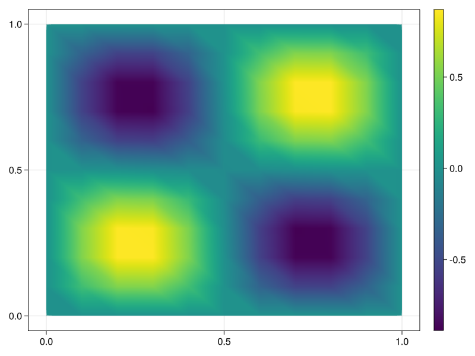
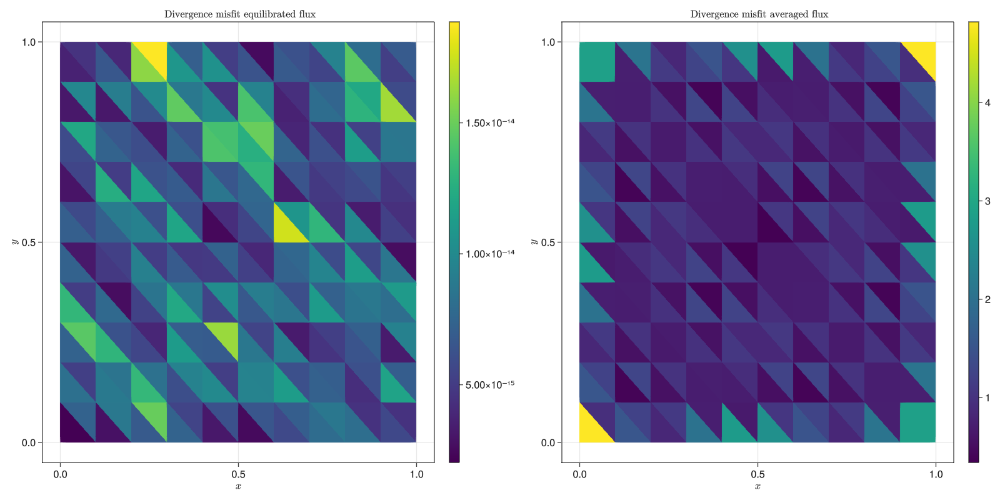

# EqFlux.jl

This package is based on the
[Gridap.jl](https://github.com/gridap/Gridap.jl/tree/master) to provide tools to calculate a
posteriori error estimates for numerical solutions of
partial differential equations (PDEs). More precisely, if we solving an abstract PDE of the
form: find $u$ such that
$$-\nabla\cdot\mathbf{A}(\nabla u) = f.$$
If we compute an approximation $u_h$ to the solution $u$ in Gridap.jl,
the `EqFlux.jl` library provides the tools to compute an estimator
$\eta(u_h)$ such that the error measured in some norm $\|\cdot\|$ can be
bounded by
$$\|u - u_h\| \le \eta(u_h),$$
which we refer to as reliability, as well as the bound
$$\eta(u_h) \lesssim \|u - u_h\|$$
which we refer to as efficiency. The main ingredient in computing this estimator
is an reconstructed flux obtained by postprocessing that is an approximation
to the to the numerical flux, i.e., $\sigma_h\approx \mathbf{A}(\nabla u_h)$. This
flux has the important property of being "conservative" in the sense
that
$$\sigma_h \in \mathbf{H}(\mathrm{div},\Omega).$$
we provide two functions to obtain this object:
`build_equilibrated_flux` and `build_average_flux`. In addition, for the
eq_field flux the so-called equilibrium condition is satisfied, i.e.,
$$\nabla\cdot\sigma_h = \Pi_pf$$
where $\Pi_p$ is the orthogonal projection onto polynomials of degree at most
$p$.

We first load the required packages

````julia
using Gridap
using Gridap.Geometry
using Gridap.Adaptivity
using GridapMakie, GLMakie
using EqFlux
using JLD2
````

Define some helper functions

````julia
L2_inner_product(f, g, dx) = ∫(f ⋅ g) * dx

L2_norm_squared(f, dx) = L2_inner_product(f, f, dx)

function L2_norm_squared(f, model, order)
  degree = 2 * order + 2
  Ω = Triangulation(model)
  dx = Measure(Ω, degree)
  L2_norm_squared(f, dx)
end

function L²_projection_f(model, reffe, f, dx)
  V = TestFESpace(model, reffe; conformity = :L2)
  m(u, v) = ∫(u * v)*dx
  b(v) = ∫(v * f) * dx
  op_proj = AffineFEOperator(m, b, V, V)
  solve(op_proj)
end

let
````

Now we consider the Laplace problem
$$\begin{align}
-\Delta u &= f &&\text{ in }\Omega\\
u &= g &&\text{ on }\partial\Omega
\end{align}$$
on the L-shaped domain. In this case, we know the true solution
is given by the following formula in polar coordinates:

````julia
  u(x) = sin(2*pi*x[1])*sin(2*pi*x[2])
````

The right hand side is zero for the Laplace equation

````julia
  f(x) = 8*pi^2*u(x)
  #u(x) = x[1] * (x[1] - 1) * x[2] * (x[2] - 1)
  #f(x) = (-2 * (x[1] * x[1] + x[2] * x[2]) + 2 * (x[1] + x[2]))
````

Now we find an approximate solution using Gridap.jl

````julia
  order = 1
  n = 10
  domain = (0,1,0,1)
  partition = (n, n)
  model = CartesianDiscreteModel(domain, partition) |> simplexify
  trian = Triangulation(model)
  degree = 2 * order + 2
  Ω = Triangulation(model)
  dx = Measure(Ω, degree)
  reffe = ReferenceFE(lagrangian, Float64, order)
  V0 = TestFESpace(model, reffe; conformity = :H1, dirichlet_tags = "boundary")
  U = TrialFESpace(V0, u)
  a(u, v) = ∫(∇(v) ⊙ ∇(u)) * dx
  b(v) = ∫(v * f) * dx
  op = AffineFEOperator(a, b, U, V0)
  uh = solve(op)
````

We then plot the approximate solution

````julia
  fig_soln, _ , plt = plot(trian, uh, colormap=:viridis)
  Colorbar(fig_soln[1,2], plt)
  #md # 
````

We now compute the two fluxes.

````julia
  𝐀ₕ = ∇(uh)
  σeq = build_equilibrated_flux(𝐀ₕ, f, model, order)
  σave = build_averaged_flux(𝐀ₕ, model)
  ηeq² = L2_norm_squared(σeq + 𝐀ₕ, dx)
  ηeq_arr = sqrt.(getindex(ηeq², Ω))
  H1err² = L2_norm_squared(∇(u - uh), dx)
  H1err_arr = sqrt.(getindex(H1err², Ω))
  ηave² = L2_norm_squared(σave + 𝐀ₕ, dx)
  ηave_arr = sqrt.(getindex(ηave², Ω))
  reffe0 = ReferenceFE(lagrangian, Float64, 0)
  Vint0 = TestFESpace(model, reffe0; conformity=:L2)
  max_val = maximum([ηave_arr..., ηeq_arr..., H1err_arr...])
  min_val = minimum([ηave_arr..., ηeq_arr..., H1err_arr...])
  #ηave_vis = FEFunction(Vint0, ηave_arr)
  ηave_vis = CellField(ηave_arr, Ω)
  ηeq_vis = FEFunction(Vint0, ηeq_arr)
  H1err_vis = FEFunction(Vint0, H1err_arr)
  fig = Figure(resolution = (700, 600))
  ga = fig[1, 1] = GridLayout()
  axerr = Axis(ga[1, 1], xlabel = L"x", ylabel = L"y", title = L"$H_0^1$ seminorm error")
  axeq  = Axis(ga[2, 1], xlabel = L"x", ylabel = L"y", title = L"$$Equilibrated flux esitmator")
  axave = Axis(ga[2, 2], xlabel = L"x", ylabel = L"y", title = L"$$Averaged flux esitmator")
  plot_error = plot!(axerr, trian, H1err_vis, colorrange=(min_val,max_val), colormap=:viridis)
  plot_eq    = plot!(axeq,  trian, ηeq_vis,    colorrange=(min_val,max_val), colormap=:viridis)
  plot_aver  = plot!(axave, trian, ηave_vis,    colorrange=(min_val,max_val), colormap=:viridis)
  Colorbar(fig[1,2], limits=(min_val, max_val), colormap=:viridis)
  #display(fig)
  #md # 
  fig = Figure(resolution = (1600, 800))
  ga = fig[1, 1] = GridLayout()
  axdiveq = Axis(ga[1, 1], xlabel = L"x", ylabel = L"y", title = L"$$ Divergence misfit equilibrated flux")
  axdivave= Axis(ga[1, 3], xlabel = L"x", ylabel = L"y", title = L"$$ Divergence misfit averaged flux")
  f_proj = L²_projection_f(model, reffe, f, dx)
  eq_div  = L2_norm_squared(∇ ⋅ σeq - f_proj, dx)
  ave_div = L2_norm_squared(∇ ⋅ σave - f_proj, dx)
  eq_div_vis = FEFunction(Vint0, sqrt.(getindex(eq_div, Ω)))
  ave_div_vis = FEFunction(Vint0, sqrt.(getindex(ave_div, Ω)))
  plot_div_eq = plot!(axdiveq, trian, eq_div_vis,    colormap=:viridis)
  Colorbar(ga[1,2], plot_div_eq)
  plot_div_ave = plot!(axdivave, trian, ave_div_vis, colormap=:viridis)
  Colorbar(ga[1,4], plot_div_ave)
  #md # 
  div_check² = L2_norm_squared(∇ ⋅ σeq - f_proj, dx)
  @show √sum(div_check²)
  @show √sum(H1err²)
  @show eff_eq = √sum(ηeq²)/ √sum(H1err²)
  @show eff_ave = √sum(ηave²)/ √sum(H1err²)
end
````

---

*This page was generated using [Literate.jl](https://github.com/fredrikekre/Literate.jl).*

