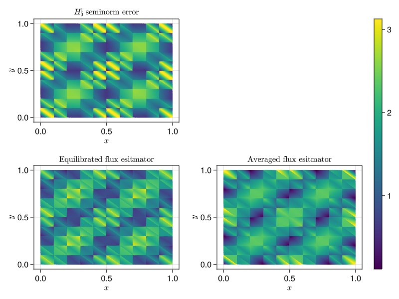
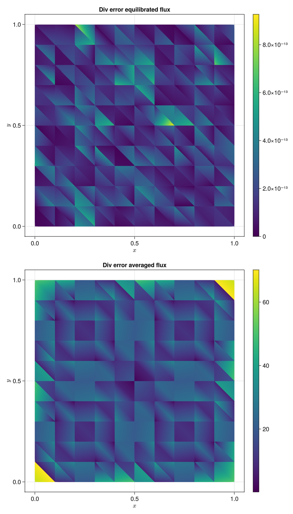

# eq_field flux

This package is based on the
[Gridap.jl](https://github.com/gridap/Gridap.jl/tree/master) to provide tools to calculate a
posteriori error estimates for numerical solutions of
partial differential equations (PDEs). More precisely, if we solving an abstract PDE of the
form: find $u$ such that
$$-\nabla\cdot\mathbf{A}(u) = f.$$
If we compute an approximation $u_h$ to the solution $u$ in Gridap.jl,
the `EqFlux.jl` library provides the tools to compute an estimator
$\eta(u_h)$ such that the error measured in some norm $\|\cdot\|$ can be
bounded by
$$\|u - u_h\| \le \eta(u_h),$$
which we refer to as reliability, as well as the bound
$$\eta(u_h) \lesssim \|u - u_h\|$$
which we refer to as efficiency. The main ingredient in computing this estimator
is an reconstructed flux obtained by postprocessing that is an approximation
to the to the numerical flux, i.e., $\sigma_h\approx \mathbf{A}(u_h)$. This
flux has the important property of being "mass conservative" in the sense
that
$$\sigma_h \in \mathbf{H}(\mathrm{div},\Omega).$$
we provide two functions to obtain this object:
`build_equilibrated_flux` and `build_average_flux`. In addition, for the
eq_field flux the so-called equilibrium condition is satisfied, i.e.,
$$\nabla\cdot\sigma_h = \Pi_pf$$
where $\Pi_p$ is the orthogonal projection onto polynomials of degree at most
$p$.

We first load the required packages

````julia
using Gridap
using Gridap.Geometry
using Gridap.Adaptivity
using GridapMakie, GLMakie
using EqFlux
using JLD2
````

Define some helper functions

````julia
L2_inner_product(f, g, dx) = ∫(f ⋅ g) * dx

L2_norm_squared(f, dx) = L2_inner_product(f, f, dx)

function L2_norm_squared(f, model, order)
  degree = 2 * order + 2
  Ω = Triangulation(model)
  dx = Measure(Ω, degree)
  L2_norm_squared(f, dx)
end

function L²_projection_f(model, reffe, f, dx)
  V = TestFESpace(model, reffe; conformity = :L2)
  m(u, v) = ∫(u * v)*dx
  b(v) = ∫(v * f) * dx
  op_proj = AffineFEOperator(m, b, V, V)
  solve(op_proj)
end

max_cell_fields(cell_fields, cell_point) =
max(maximum(map(maximum, evaluate(cell_field, cell_point)) for cell_field in cell_fields)...)

min_cell_fields(cell_fields, cell_point) =
min(minimum(map(minimum, evaluate(cell_field, cell_point)) for cell_field in cell_fields)...)
````

Now we consider the Laplace problem
$$\begin{align}
-\Delta u &= f &&\text{ in }\Omega\\
u &= g &&\text{ on }\partial\Omega
\end{align}$$
on the L-shaped domain. In this case, we know the true solution
is given by the following formula in polar coordinates:

````julia
#u(x) = sin(2*pi*x[1])*sin(2*pi*x[2])
````

The right hand side is zero for the Laplace equation

````julia
#f(x) = 8*pi^2*u(x)
u(x) = 30*x[1] * (x[1] - 1) * x[2] * (x[2] - 1)
f(x) = 30*(-2 * (x[1] * x[1] + x[2] * x[2]) + 2 * (x[1] + x[2]))
````

Now we find an approximate solution using Gridap.jl

````julia
order = 1
n = 10
domain = (0,1,0,1)
partition = (n, n)
model = CartesianDiscreteModel(domain, partition) |> simplexify
#model = refine(model)
trian = Triangulation(model)
#trian_fig = plot(trian)
#wireframe!(trian, color=:black, linewidth=2);
#@time uh, dofs = solve_poisson(model, u, f, order)
degree = 2 * order + 2
Ω = Triangulation(model)
dx = Measure(Ω, degree)
reffe = ReferenceFE(lagrangian, Float64, order)
V0 = TestFESpace(model, reffe; conformity = :H1, dirichlet_tags = "boundary")
U = TrialFESpace(V0, u)
a(u, v) = ∫(∇(v) ⊙ ∇(u)) * dx
b(v) = ∫(v * f) * dx
op = AffineFEOperator(a, b, U, V0)
uh = solve(op)
fig_soln, _ , plt = plot(trian, uh)
Colorbar(fig_soln[1,2], plt)
````


````julia
Qₕ = CellQuadrature(Ω,degree)
Qₕ_cell_point = get_cell_points(Qₕ)
𝐀ₕ = ∇(uh)
σ = build_equilibrated_flux(𝐀ₕ, f, model, order)
σ_ave = build_averaged_flux(𝐀ₕ, model)
η² = L2_norm_squared(σ + 𝐀ₕ, dx)
H1err² = L2_norm_squared(∇(u - uh), dx)
````

Cell fields

````julia
eq_field    = norm ∘ (σ + 𝐀ₕ)
av_field    = norm ∘ (σ_ave + 𝐀ₕ)
H1err_field = norm ∘ ∇(u - uh)
max_val = max_cell_fields([eq_field, av_field, H1err_field], Qₕ_cell_point)
min_val = min_cell_fields([eq_field, av_field, H1err_field], Qₕ_cell_point)
fig = Figure(resolution = (800, 600))
ga = fig[1, 1] = GridLayout()
axerr = Axis(ga[1, 1], xlabel = L"x", ylabel = L"y", title = L"$H_0^1$ seminorm error")
axeq  = Axis(ga[2, 1], xlabel = L"x", ylabel = L"y", title = L"$$Equilibrated flux esitmator")
axave = Axis(ga[2, 2], xlabel = L"x", ylabel = L"y", title = L"$$Averaged flux esitmator")
plot_error = plot!(axerr, trian, H1err_field, colorrange=(min_val,max_val), colormap=:viridis)
plot_eq    = plot!(axeq,  trian, eq_field,    colorrange=(min_val,max_val), colormap=:viridis)
plot_aver  = plot!(axave, trian, av_field,    colorrange=(min_val,max_val), colormap=:viridis)
Colorbar(fig[1,2], limits=(min_val, max_val), colormap=:viridis)
display(fig)
````



````julia
fig = Figure(resolution = (800, 1400))
ga = fig[1, 1] = GridLayout()
axdiveq = Axis(ga[1, 1], xlabel = L"x", ylabel = L"y", title = "Div error equilibrated flux")
axdivave= Axis(ga[2, 1], xlabel = L"x", ylabel = L"y", title = "Div error averaged flux")
f_proj = L²_projection_f(model, reffe, f, dx)
eq_div_field  = norm ∘ (∇ ⋅ σ - f_proj)
ave_div_field = norm ∘ (∇ ⋅ σ_ave - f_proj)
plot_div_eq = plot!(axdiveq, trian, eq_div_field,    colormap=:viridis)
Colorbar(ga[1,2], plot_div_eq)
plot_div_ave = plot!(axdivave, trian, ave_div_field, colormap=:viridis)
Colorbar(ga[2,2], plot_div_ave)
````



````julia
div_check² = L2_norm_squared(∇ ⋅ σ - f_proj, dx)
@show √sum(div_check²)
@show √sum(H1err²)
@show eff = √sum(η²)/ √sum(H1err²)
````

---

*This page was generated using [Literate.jl](https://github.com/fredrikekre/Literate.jl).*

